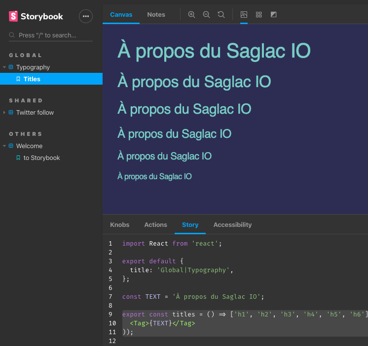

<div align="center"  style="margin-bottom: 30px;">
  <a alt="Saglac IO website" href="https://saglac.io" target="_blank">
    
  </a>
</div>

<div align="center" style="margin-bottom: 30px;">
  <a href="https://github.com/emileber/gatsby-test/actions">
    
  </a>
  <a href="https://github.com/vagr9k/gatsby-advanced-starter/stargazers">
    
  </a>
  <a href="https://github.com/emileber/gatsby-test/blob/master/LICENSE">
    
  </a>
</div>

# Saglac IO website

Made in our free time with [Gatsby](https://github.com/gatsbyjs/gatsby/). Based on [`Vagr9K/gatsby-advanced-starter`](https://github.com/Vagr9K/gatsby-advanced-starter/) with a huge amount of improvements.

It is built with the [JAMStack](https://jamstack.org/), which means it's static files enhanced with some JavaScript here and there. Our files are then hosted on Netlify, which really pairs well with Gatsby and the open-source ecosystem.

## How to add an event?

See yaml files in [`./data/`](./data/).

- an event is added as a .yml file in `data/io-events`
- authors are in `data/authors`
- locations are in `data/locations`

Make sure the **Authors** and **Locations** have the necessary models before creating a new event.

Example PR adding an event: https://github.com/saglacio/saglac.io/pull/15

## Development

We use NodeJS **version 18**. You can use [NVM](https://github.com/nvm-sh/nvm) or [Volta](https://volta.sh/) or any other NodeJS version manager to install it.

Install the project:

```sh
git clone https://github.com/saglacio/saglac.io.git saglacio
cd saglacio
# Install the dependencies
npm i
# Start the development server
npm start
```

To ease the development, there are some tools already installed.

### GraphQL

An in-browser IDE for exploring GraphQL data available in our Gatsby setup.

While the development server is started (with the previous command), the IDE should be available at:

[http://localhost:8000/\_\_\_graphql](http://localhost:8000/___graphql)

### Storybook

> Storybook is an open source tool for developing UI components in isolation for React, Vue, and Angular.



Since we're developing the website with React components, a Storybook app is available in development:

```sh
# Run this in another shell in parallel with the dev server
npm run storybook
```

Then, it should automatically navigate to `http://localhost:6006/`.

Otherwise, it's always available on the public website under [`https://saglac.io/storybook`](https://saglac.io/storybook/?path=/info/).

### Webpack Bundle Analyzer

The plugin is configured. Just run

```sh
npm run analyze
```

Then it should automatically open the browser page.

## Authors

- Emile Bergeron ([@emileber](https://github.com/emileber))
- Gabriel Le Breton ([@gableroux](https://gableroux.com/))
- Raphaël Côté ([@qwertyuu](https://github.com/qwertyuu))
- You? :)
